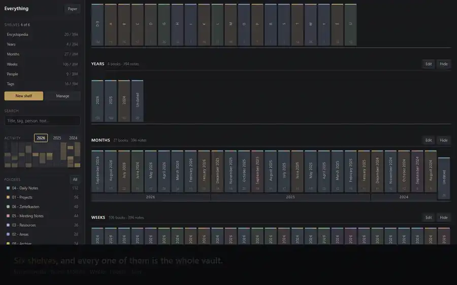

# Vault Shelf

**Your Obsidian vault as a browsable library.** Shelves of books built from titles, dates,
people, tags, folders or any note property — read as a two-page spread, with an index down the
right edge and a bookmark that survives the shelf being rearranged.

**The notes never move.** Shelves and books are views over the files that are already there,
so one note sits in Encyclopedia **A**, the **2026** yearbook, **September 2026**, **Week 37**,
**Mira's** volume and the **Attention** anthology at the same time. That overlap is the point:
each shelf is another useful address into one vault.

Sister project to [Vault Graph](https://github.com/luke321/vault-graph), which draws the same
vault as one disc. Both are deterministic, local, and make no network requests at all.



*Six shelves over a 394-note vault. The full 83-second walkthrough is
`node scripts/record-demo.mjs`.*

---

## What it does

**Six shelves on first open, and every one of them is the whole vault.**

| Shelf | A book is |
|---|---|
| **Encyclopedia** | a title initial, with an explicit `0–9` volume |
| **Years** | a year |
| **Months** | a calendar month, grouped under year plaques |
| **Weeks** | an ISO week, Monday to Sunday, grouped under year plaques |
| **People** | a person named in a note's people property |
| **Tags** | a tag, with parent tags optionally collecting their children |

**And you can build your own, from two questions.** *Which notes belong here* — the whole
vault, a tag, a person, a folder. *What makes a book* — title initial, year, month, ISO week,
person, tag, folder, or any frontmatter property you have. The builder previews the real
answer before you save: the actual note count, the actual books, the actual spines.

**Reading a book** opens a spread without losing your place on the shelf. Contents and a
*find within this book* on the left, **the note rendered by Obsidian's own renderer** on the
right — wikilinks, embeds, callouts, tasks and code, exactly as the app draws them — index
tabs down the edge: months
for a year, days for a month, initial ranges for anything alphabetical. **Also shelved in**
steps sideways to another book while staying on the same note. **Previous collection** and
`Alt+←` walk back. A bookmark saves the note to the Reading table, and re-resolves itself if
that shelf is later hidden.

**Three things a real shelf cannot do.**

- **Shelf wear.** Books you open often look handled — the boards darken, the corners soften,
  and they never sit quite flush again. The room remembers your habits without a dashboard.
- **Ribbons that hang.** A saved note leaves a ribbon out of the bottom of the book, visible
  from across the room. Because one note is in six books, one ribbon shows in six places — and
  it re-threads itself if you rename the note or hide the shelf.
- **The shelf parts as you type.** Searching does not empty the library. Matching books draw
  forward and gain air; the rest thin to ghosts and stay exactly where they were. Clear the box
  and the room is back, because it was never taken apart.

**It looks like Vault Graph, because it is painted from Vault Graph.** The same twelve colour
slots, the same surfaces, the same text ramp — read from the stylesheet rather than copied, so
a folder that is `#2a78d6` on the disc is `#2a78d6` on a spine. Light and dark follow
Obsidian's own theme.

---

## Install

Not in the community directory yet. Until it is:

1. Download `main.js`, `manifest.json` and `styles.css` from the
   [latest release](https://github.com/luke321/vault-shelf/releases/latest).
2. Put them in `<your vault>/.obsidian/plugins/vault-shelf/`.
3. Reload plugins in **Settings → Community plugins**, and enable **Vault Shelf**.
4. Click the bookshelf in the ribbon, or run **Vault shelf: Open the library**.

Every release asset carries a build-provenance attestation, so you can check that the file you
downloaded was built from this repository at that tag and not assembled by hand:

```bash
gh attestation verify main.js --repo luke321/vault-shelf
```

## Settings

| | |
|---|---|
| **Date properties** | comma-separated frontmatter fields, tried in order. A note with none of them falls back to a date at the start of its title |
| **People property** | the property that names people. People are **never** inferred from a note's prose |
| **Fall back to the file's own date** | off by default. A file's modification time is almost never the date the note is about — a sync or a bulk reformat restamps the whole vault — so a note with no date goes to **Undated** instead, where you can see it |
| **Leather binding** | off by default. Binds the library in leather and gilt instead of following your theme: dyed spines with raised bands, a stained plank, brass plaques, and an open book on marbled endpapers. It changes paint only — the same shelves, the same books, the same addresses |

The theme is not a setting: by default the library follows Obsidian's and re-reads its palette
when you change it. **Leather binding** is the one look that does not, which is exactly why it
has to be asked for.

## What it promises

- **It never writes to your notes.** Shelves are built from Obsidian's metadata cache alone;
  the only file it ever reads is the one note you have open, to render it.
- **It makes no network requests.** Not one, and
  [`scripts/check-network.mjs`](scripts/check-network.mjs) refuses a push that adds one.
- **It never guesses.** A note with no date is Undated; a note with nobody named names nobody.
  A confidently wrong shelf is worse than a visibly incomplete one.

## The standalone exporter

The same library, as one self-contained HTML file that opens off a disk with no Obsidian at
all. It is what the invariant suite drives, and it is useful on its own:

```bash
node src/build-shelf.mjs --vault "/path/to/your/vault" --out ./vault-shelf.html
```

The file contains every note title, path, tag, person and body in plain text. Do not paste one
into an issue.

## Contributing

[`CONTRIBUTING.md`](CONTRIBUTING.md) has the gates and the branch policy;
[`.ai-context/`](.ai-context/) has the reasoning behind every decision that looks arbitrary.
Issues are the way in.

## Licence

MIT. See [`LICENSE`](LICENSE).
